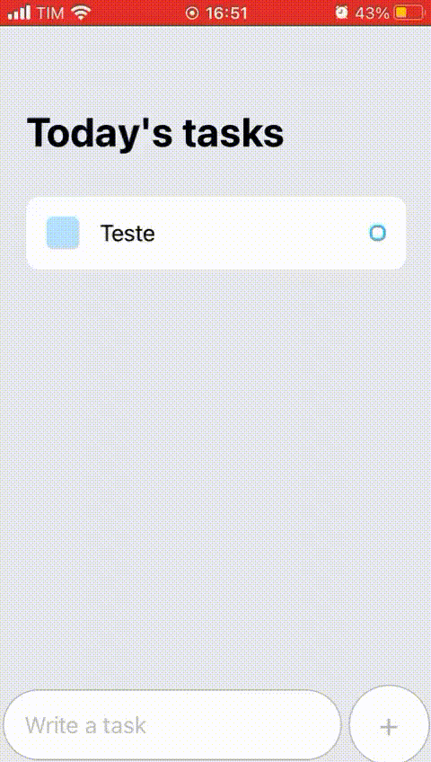
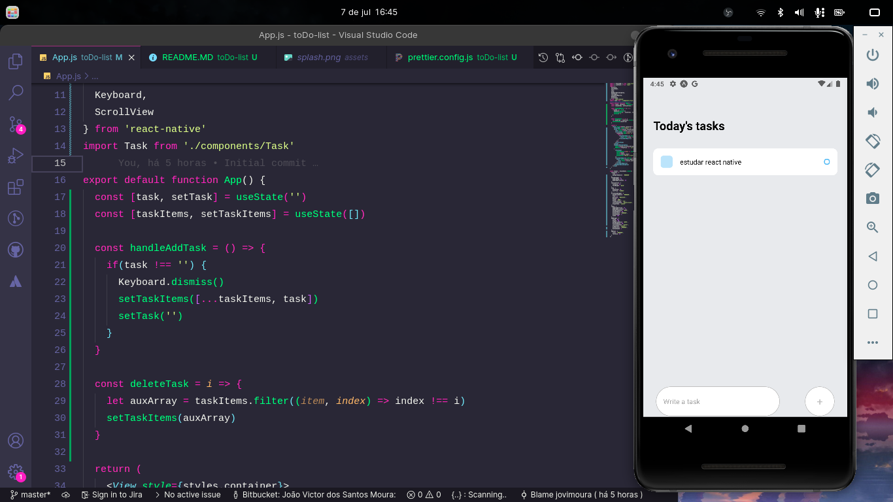

# To Do List 📱

<p>
  🇺🇸 To Do List made with React Native, Expo and JavaScript!
</p>

<br />

<p>
  🇧🇷 To Do List feito com React Native, Expo e JavaScript!
</p>

## 🇺🇸 If you want to analyze the project on your machine, follow this step by step. 🇧🇷 Caso você queira analisar o projeto em sua máquina, siga este passo a passo: 😁

<br />

## 🇺🇸 ENG

### Clone😎

```
git clone https://github.com/jovimoura/toDoList-mobile
```

### Access the folder🤓

```
cd <folder>
```
### Install dependencies🤠

```
npm install
```
### Start application🤩

```
npm run start
```
### default port:🤗

```
exp://192.168.0.12:19000
```

<br>

## 🇧🇷 PT-BR

### Clone o repositório😎

```
git clone https://github.com/jovimoura/toDoList-mobile
```

### Acesse o diretorio🤓

```
cd <nome-da-pasta>
```
### Instale as dependências🤠
```
npm install
```
### Inicie a aplicação🤩
```
npm run start
```
### A aplicação, por padrão, fica na porta:🤗

```
exp://192.168.0.12:19000
```

## 🇺🇸 Image | 🇧🇷 Imagem do projeto  💻






##  🇺🇸 Tecnologies and Libs | 🇧🇷 Tecnologias e Bibliotecas utilizadas🦉

<ul>
    <li>React Native</li>
    <li>JavaScript</li>
    <li>Expo</li>
</ul>

##  🇧🇷 Feito por | 🇺🇸 Made by:

### João Victor dos Santos Moura
### E-mail: joaovictors.mouraa@gmail.com
### Linkedin: https://www.linkedin.com/in/jovimoura10/
